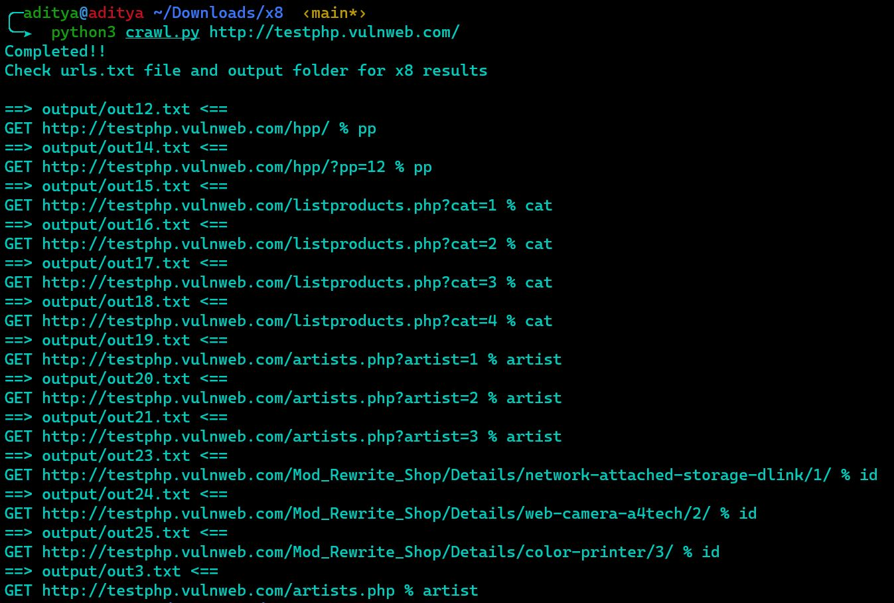

# hakrawlerx8chain
### Tools needed:-
1. https://github.com/hakluke/hakrawler (Check installation here)
2. https://github.com/Sh1Yo/x8 (Check installation here)

---
### Features
1. Removes duplicate and other urls from hakrawler result
2. Runs x8 parameter discovery tool on all the URLS from hakrawler
### Usage
1. python3 run.py http://testphp.vulnweb.com/

